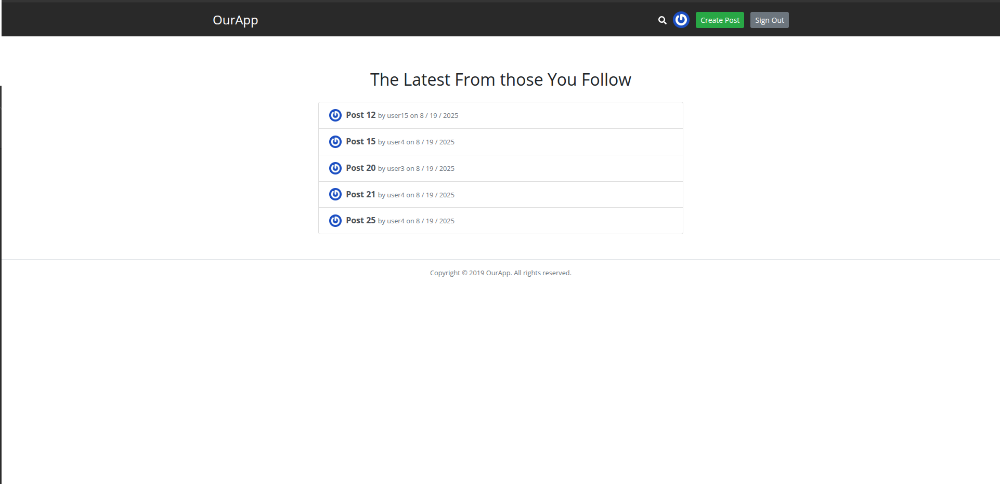
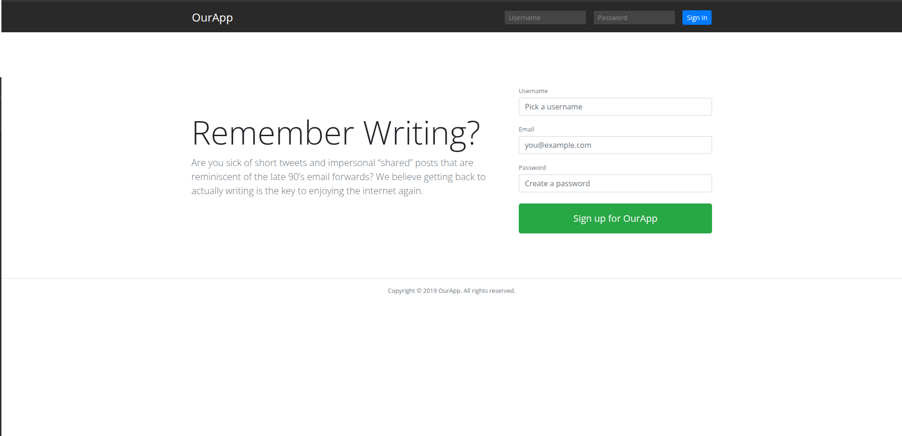
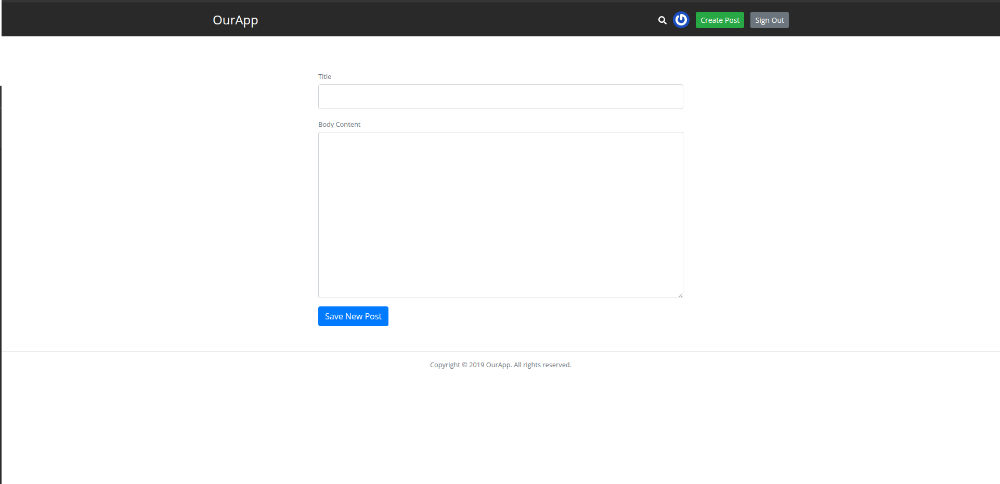
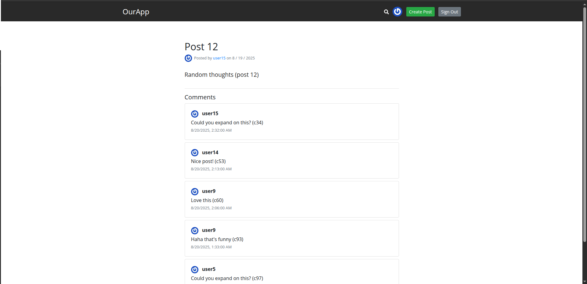
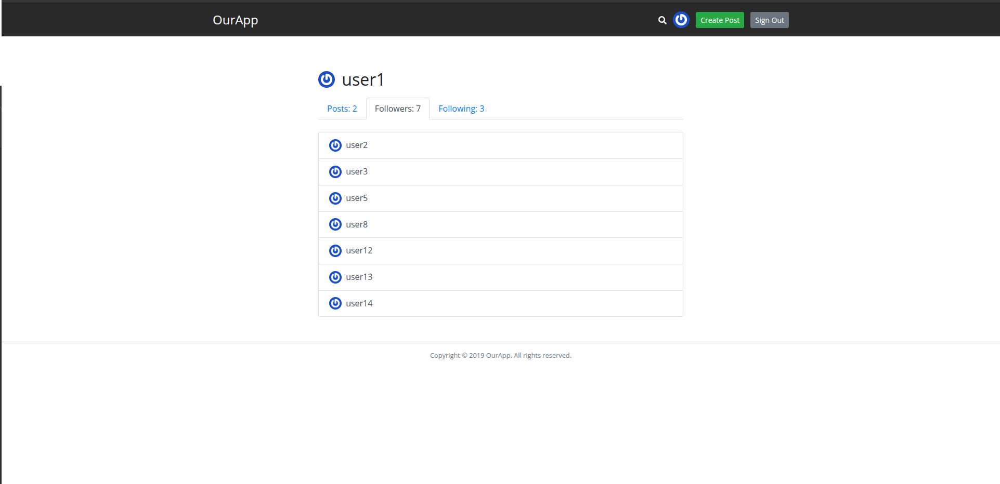
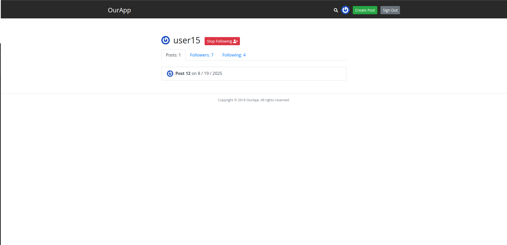
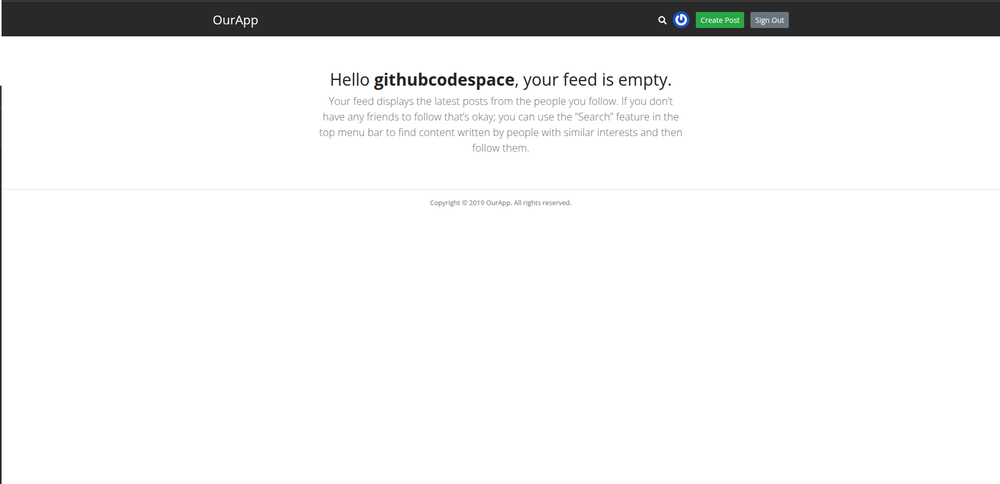

# Twitter-clone (based on the Udemy course)

Small blogging/following application (Twitter-like) built with Node.js, Express, MongoDB and EJS.

## Features

- Session-based authentication (express-session + connect-mongo)
- Private routes and middleware for authentication
- Create, edit, delete posts
- Follow/unfollow users and view followers/following lists
- Full-text post search
- Gravatar-based avatars

## Quick demo

Local development: run the app and open http://localhost:5000

## Setup and run (development)

# Twitter-clone

Lightweight Twitter-like app (blogging + following) built with Node.js, Express, MongoDB and EJS templates.

This repository is a learning project that demonstrates a small social feed: user registration/login, creating posts, following users, and viewing feeds and profiles. A seed script is included to populate the database with realistic mock data for screenshots and manual testing.

## Features

- Session-based auth using `express-session` + `connect-mongo`
- Register, login, logout flows
- Create / edit / delete posts
- Follow / unfollow users and view followers / following lists
- Feed of posts from followed users
- Full-text search for posts
- Gravatar avatars
- Server-rendered EJS views with minimal frontend JS

## Screenshots

The repository includes a `screenshots/` folder. Below are the included images (click to view):

- Feeds — `screenshots/feeds.png`

  

- Landing / Guest — `screenshots/landing.png`

  

- Single post (no comments) — `screenshots/post.png`

  

- Single post with comments — `screenshots/post_with_comments.png`

  

- Profile page — `screenshots/profile.png`

  

- User card / mini profile — `screenshots/user.png`

  

- User landing (user's feed) — `screenshots/user_landing.png`

  

If you want smaller thumbnails or captions styled differently, I can adjust the README to use a table or HTML for a more compact layout.

## Quick start (development)

Prerequisites:

- Node.js (v16+ recommended, newer versions work but Webpack may require the OpenSSL legacy provider)
- A MongoDB instance (Atlas URI or local)

1. Install dependencies

```bash
npm install
```

2. Add environment variables

Create a `.env` file in the project root. Example:

```env
CONNECTIONSTRING="mongodb+srv://...your-mongo-uri..."
PORT=5000
```

If you already used the provided connection string earlier, make sure the `.env` contains a valid `CONNECTIONSTRING`.

3. Build frontend assets (optional — `public/main-bundled.js` is already committed in this repo)

If you need to rebuild the frontend bundle and you get OpenSSL errors with newer Node versions, run:

```bash
export NODE_OPTIONS=--openssl-legacy-provider
npx webpack
```

4. Seed the database (optional but recommended for screenshots/testing)

This repo includes a seed script that inserts mock users, follow relationships, posts and comments.

```bash
# run the seed script (must have .env set)
node scripts/seed.js
```

After running the seed you should see output like:

```
Seed completed:
	users: 15
	follows: 68
	posts: 30
	comments: 100
```

5. Start the app

```bash
npm start
```

Open http://localhost:5000 in your browser (or the port set in `PORT` environment variable).

## Test credentials

The seed script creates 15 users with predictable credentials for quick testing.

- Username: `user1` ... `user15`
- Email: `user1@example.com` ... `user15@example.com`
- Password (all): `password`

Example curl login (saves cookies to `cookiejar`):

```bash
curl -i -X POST -d "username=user1&password=password" -c cookiejar http://localhost:5000/login
```

## Where seed data is inserted

- Users -> `users` collection
- Posts -> `posts` collection
- Follows -> `follows` collection
- Comments -> `comments` collection

The seed script is at: `scripts/seed.js`.

## Troubleshooting

- Webpack/OpenSSL errors on Node 17+: set the legacy OpenSSL provider before running `npx webpack`:

```bash
export NODE_OPTIONS=--openssl-legacy-provider
npx webpack
```

- If the server can't start due to Mongo driver/connect-mongo API differences, make sure dependencies are up-to-date and your `db.js` uses `MongoClient` (this repo already includes updates for modern mongodb versions).

- If login returns "Invalid Credentials":
  - Ensure you used the seeded username (`user1`) and password (`password`), or register a new user via the UI.
  - Check server logs for errors and confirm the database connection is established.

## Extending the app

- Add client-side comment creation form and a POST /comments endpoint (not present by default).
- Add pagination and infinite scroll for feeds.
- Add file upload for avatars.

## Development notes

- Views use EJS templates located in `views/`.
- Router endpoints are declared in `router.js`.

## License

This project is provided under the MIT license.
